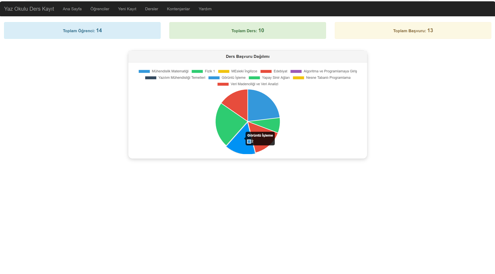
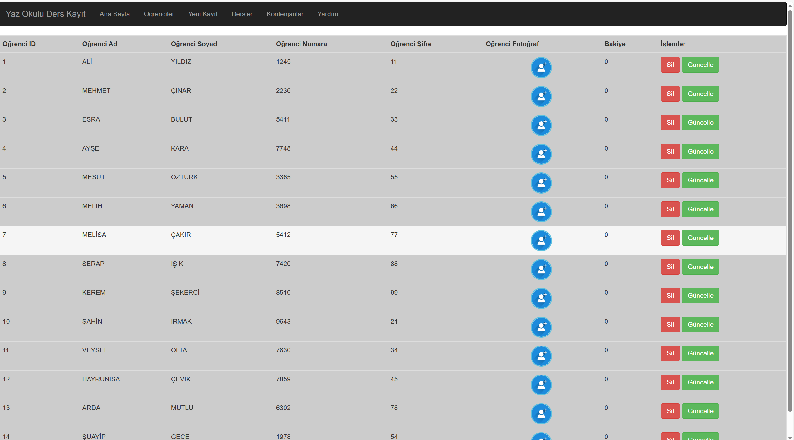
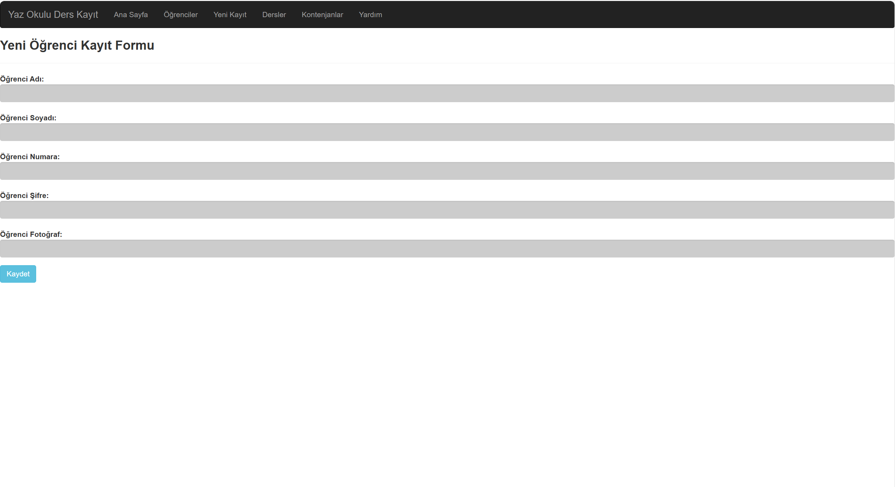
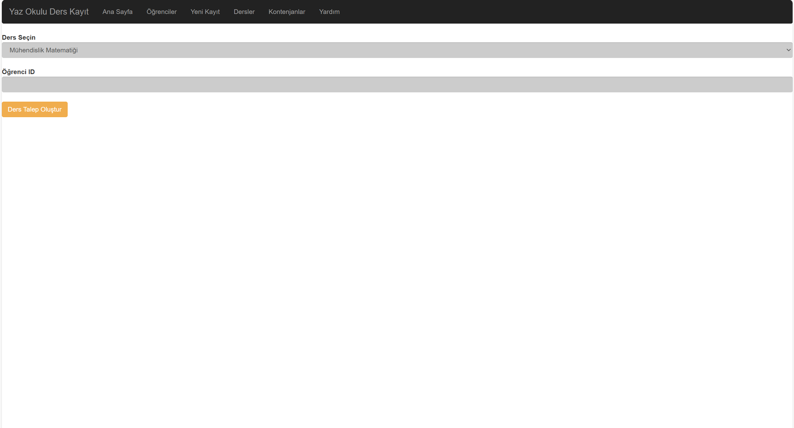
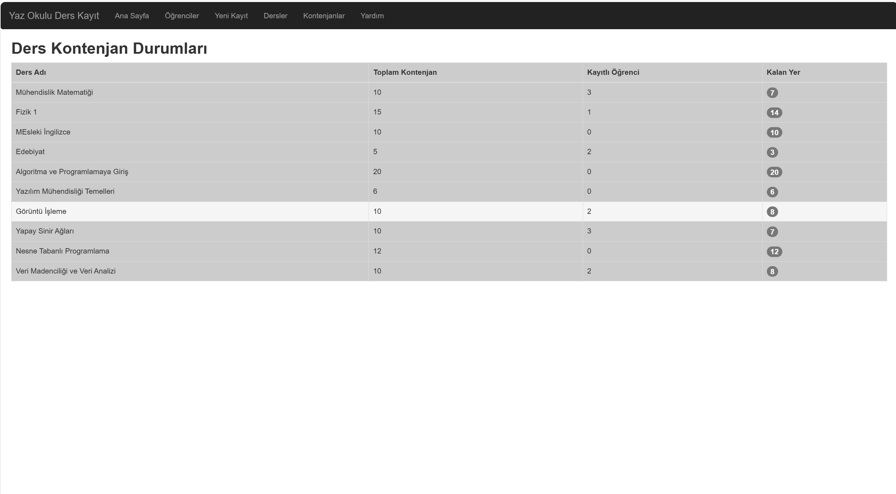

# 🎓 Asp.Net ile Katmanlı Mimari: Yaz Okulu Ders Kayıt Sistemi

Bu proje, öğrencilerin yaz okulu döneminde ders seçimlerini, kayıt işlemlerini ve kontenjan takibini yönetmek amacıyla **Katmanlı Mimari (N-Tier Architecture)** yapısı kullanılarak geliştirilmiştir. 

Projenin temel yapısı **Murat Yücedağ** eğitiminden referans alınmış; **Grafiksel İstatistikler** ve **Dinamik Kontenjan Yönetimi** kısımları tarafımca özgün olarak eklenmiştir.

## 🚀 Öne Çıkan Özellikler
* **Katmanlı Mimari:** DataAccessLayer, BusinessLogicLayer, EntityLayer ve UI katmanları ile sürdürülebilir kod yapısı.
* **Öğrenci Yönetimi:** Öğrenci kayıt, listeleme, silme ve güncelleme (CRUD) işlemleri.
* **Ders Talep Sistemi:** Öğrencilerin seçtikleri dersler için dinamik talep oluşturma altyapısı.
* **📊 Görsel Analiz (Özgün Eklemem):** Derslerin başvuru dağılımlarının pasta grafiği (Pie Chart) üzerinden anlık gösterimi.
* **📋 Kontenjan Takibi (Özgün Eklemem):** Derslerin toplam kontenjan, kayıtlı öğrenci ve kalan yer durumlarının anlık takibi.

## 🛠️ Kullanılan Teknolojiler
* **Backend:** ASP.NET Web Forms / C#
* **Mimari:** Katmanlı Mimari (N-Tier)
* **Frontend:** Bootstrap 4/5, CSS, HTML
* **Veritabanı:** MS SQL Server
* **Grafik Kütüphanesi:** Chart.js veya ASP.NET Chart araçları

## 📸 Ekran Görüntüleri
### 1. Dashboard ve Ders Başvuru Dağılımı

### 2. Öğrenci Yönetim Paneli

### 3. Yeni Kayıt Paneli

### 4. Dersler Paneli

### 5. Ders Kontenjan Durumları

